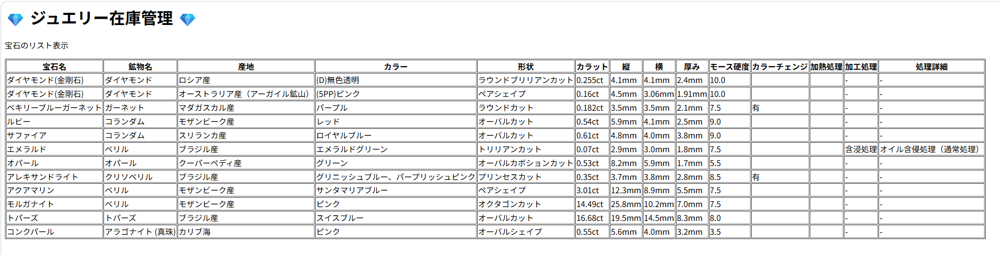

## 2026/04/21 進捗：JSTLによる一覧表示の実装
DBから取得した12件の宝石データを、JSTLの `forEach` を使ってテーブル形式で表示しました。
三項演算子や `empty` を活用し、データの有無に応じた表示の最適化も行っています。

2026/04/16(3時間20分) データベース設計完了。
業務のワークフローを意識し、12個のプロパティ
（鉱物・宝石名、海岸、三辺サイズ、硬度、エンハンスメント処理等）を定義。

日々の作業記録や勉強用ノート
https://docs.google.com/spreadsheets/d/1R9Bap7r7L12_NAqROqKKhv4PLGIs2n98jtOxY3xNseA/edit?usp=sharing

